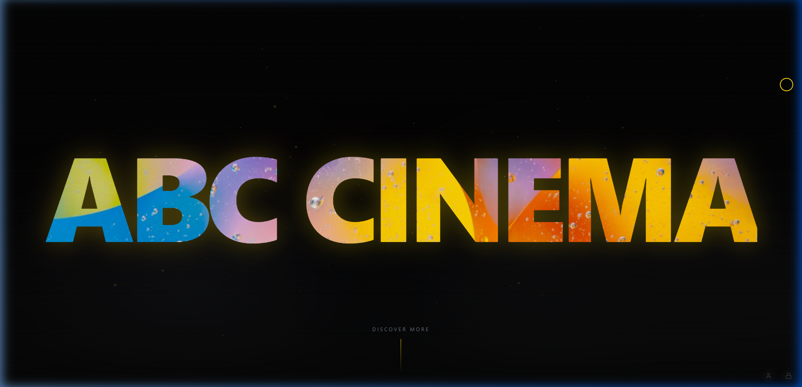
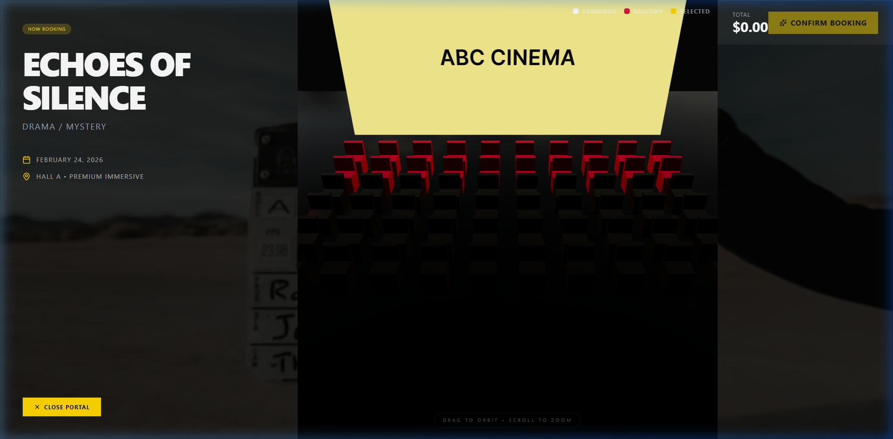
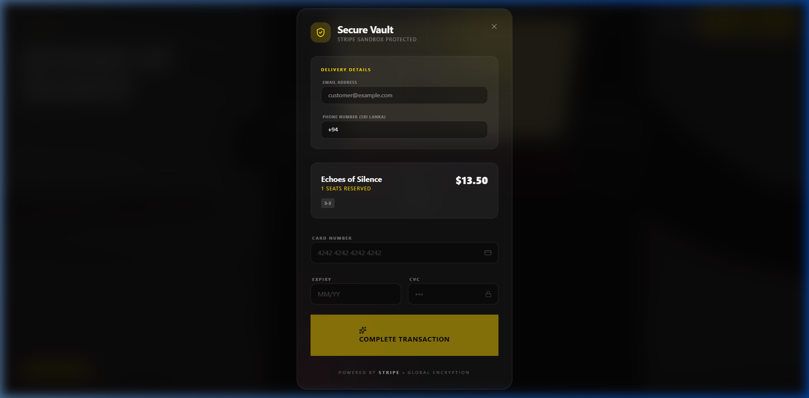
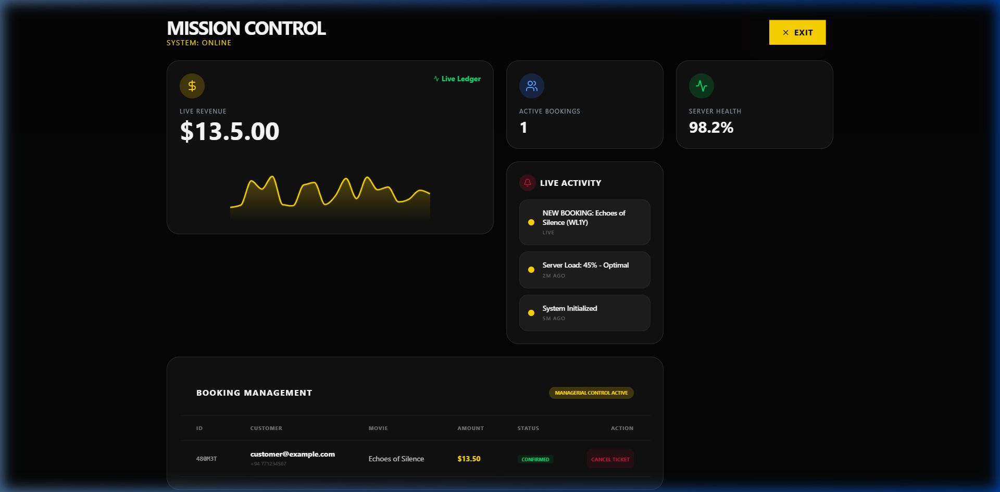
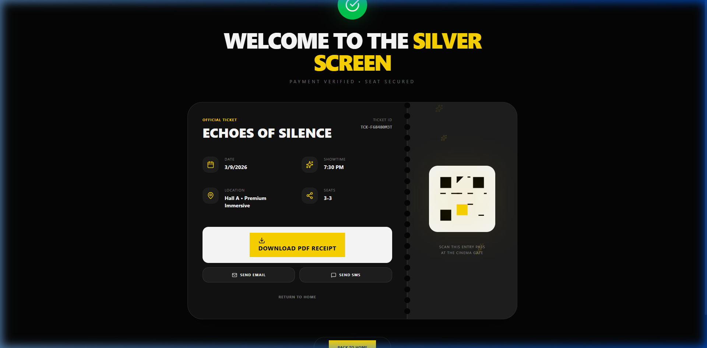
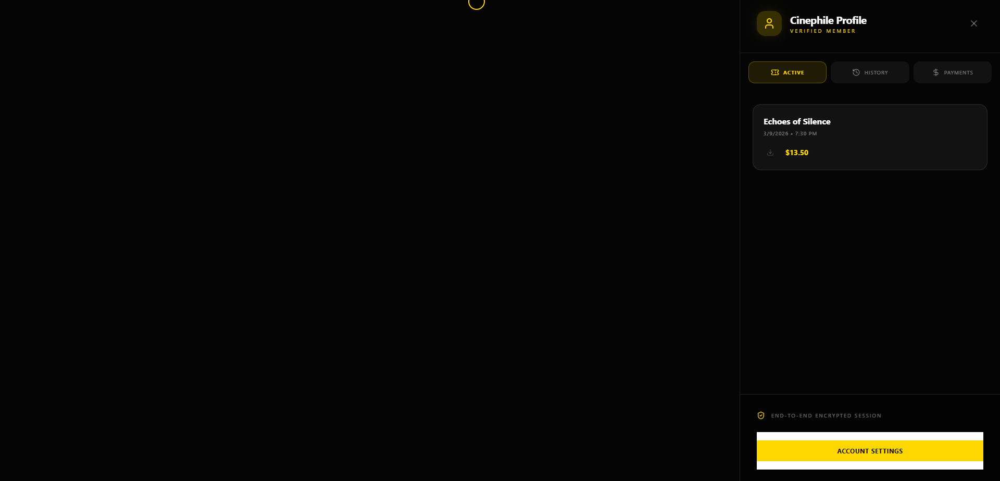
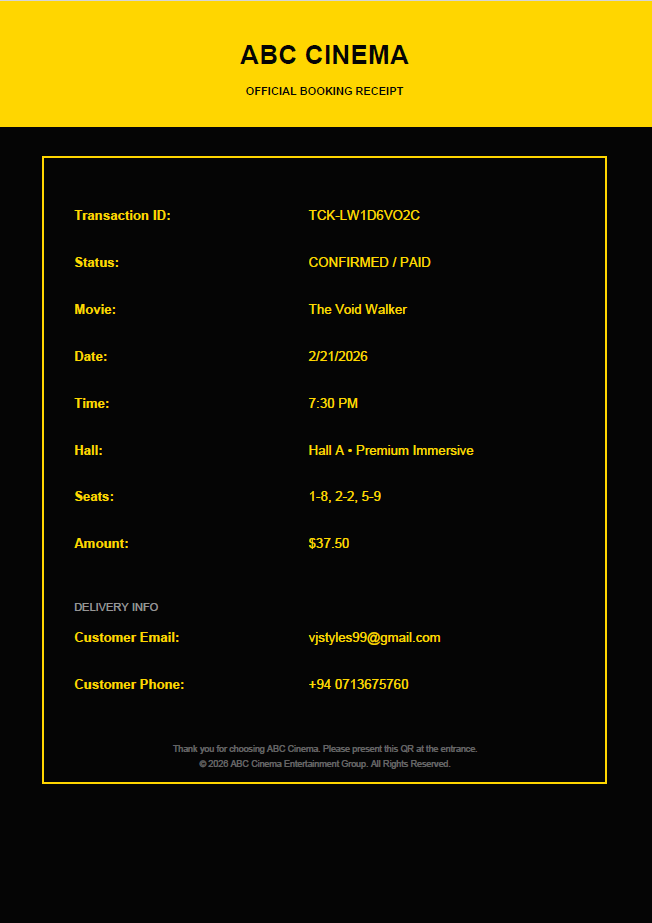
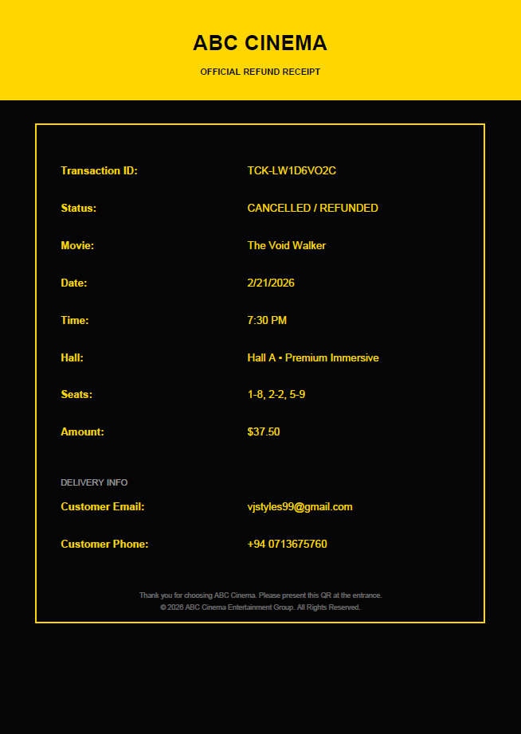
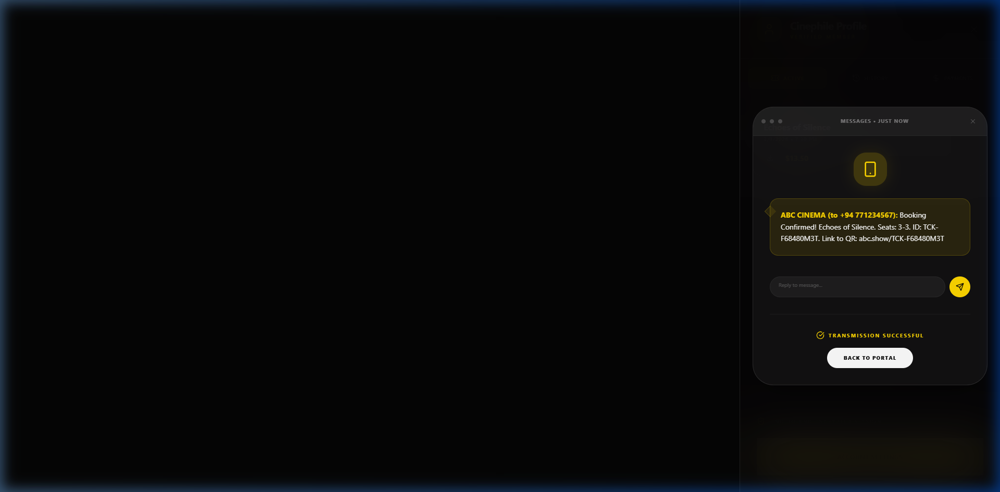

  
  
  
  
  
  
  

# 🎬 ABC Cinema

> **Immersive Cinema Ticket Booking Experience with Premium Motion & 3D Optics.**

ABC Cinema is a **high-end MERN stack platform** designed to **revolutionize the digital cinema booking experience** by blending immersive 3D technology with a seamless administrative interface.

The system focuses on **visual excellence and intuitive user flow**, aiming to **bridge the gap between web applications and cinematic storytelling**.

---

# ✨ Key Features

| Feature | Description |
|---|---|
| 🧊 **3D Seat Selection** | Immersive Three.js-powered isometric and prospective seat mapping for a realistic hall preview. |
| 💳 **Secure Stripe Checkout** | Enterprise-grade payment processing with real-time validation and success/failure handling. |
| 🎭 **Liquid Motion UI** | Ultra-smooth GSAP and Framer Motion transitions, including liquid distortion poster effects. |
| 📊 **Admin Control HQ** | Comprehensive dashboard for managing movies, tracking transactions, and monitoring site performance. |
| 📄 **Smart Ticket Engine** | Automated PDF ticket generation with unique QR/UUID identifiers for secure entry. |
| ⚡ **Zustand State Engine** | High-performance centralized state management for seamless cross-view transitions. |

---

# 🎬 Project Demonstration

The following resources demonstrate the system's behavior:

- [📹 Product walkthrough video](#-product-video)
- [📸 Screenshots of key features](#-screenshots)
- [📄 System architecture overview](#-architecture-overview)
- [🧠 Engineering lessons](#-engineering-lessons)
- [🔧 Design decisions](#-key-design-decisions)
- [🗺️ Roadmap](#-roadmap)
- [🚀 Future improvements](#-future-improvements)
- [📄 Documentation](#-documentations)
- [📝 License](#-license)
- [📩 Contact](#-contact)

---

# 📹 Product Video

> **[DEMONSTRATION PENDING]**

*A comprehensive video or GIF of the system's walkthrough demonstrating the 3D Seat Mapping, Stripe Integration, and Admin HQ workflows is available upon request for technical review.*

---

# 📸 Screenshots

### 🏠 Landing Page

### 🧊 3D Seat Map

### 💳 Secure Checkout

### 📊 Admin Dashboard

### 📄 PDF Ticket View

### 👤 User Profile

| 🎟️ Booking Ticket | 🚫 Cancellation Pass |
|:---:|:---:|
|  |  |

### 💬 Confirmation

---

# ⚙️ Architecture Overview

ABC Cinema follows a **Clean-Aligned Modular Architecture**. While the current structure is organized into feature-based modules and centralized services, we are on a path towards a strict **Clean Architecture & DDD** implementation.

### Current State:
- **Modular Presentation:** React components are grouped by functional areas (Admin, Booking, Three).

### Frontend
- **React 19** (Concurrent Rendering)
- **Three.js / React Three Fiber** (3D Visuals)
- **GSAP & Framer Motion** (Premium Animations)
- **Tailwind CSS v4** (Next-gen Styling)

### Backend
- **Node.js & Express** (Scalable API Layer)
- **MongoDB & Mongoose** (NoSQL Data Modeling)
- **JWT & AES** (Secure Authentication & Data Protection)

### Communication
- **RESTful API Architecture**
- **JSON Payload Exchange**

### State & Persistence
- **Zustand** (Global Store)
- **Local Browser Storage** (Session Continuity)
- **PDF Service** (Dynamic Document Generation)

---

### Future Roadmap:
- [ ] **Physical Layer Separation:** Explicit refactoring into `domain`, `application`, `infrastructure`, and `presentation` directories.
- [ ] **Domain Entity Modeling:** Transitioning from static data to rich domain entities with business logic.
- [ ] **Dependency Rule Enforcement:** Ensuring outer layers (UI/Services) only depend on inner layers (Business Logic).

---

# 🧠 Engineering Lessons

During development of ABC Cinema, the focus areas included:

- **3D Render Optimization:** Managing canvas performance in React for high-frame-rate interaction.
- **Transactional Integrity:** Ensuring Stripe payment webhooks (simulated) correctly sync with the local state.
- **Motion Orchestration:** Sequencing complex GSAP timelines with React component lifecycles.
- **UX for Technical Data:** Designing an Admin HQ that remains intuitive despite complex data sets.
- **Scalable State:** Moving from basic hooks to Zustand for managing a multi-step booking funnel.

---

# 🔧 Key Design Decisions

1. **Fiber-First 3D Rendering**
   Using *React Three Fiber* instead of vanilla Three.js allowed for a declarative approach to 3D, keeping seat state synced with React state seamlessly.

2. **Zustand over Redux**
   Chose Zustand for its minimal boilerplate and superior performance with frequent state updates (like hover effects and selection).

3. **Hybrid Animation Strategy**
   GSAP was used for heavy-lifting orchestrations, while Framer Motion handles simple entry/exit transitions for code maintainability.

4. **Static PDF Generation**
   Implemented client-side PDF generation to reduce server load and provide instant gratification upon successful booking.

---

# 🗺️ Roadmap

Key upcoming features and current status:

- [x] **DONE** 3D Seat Mapping — Core isometric engine implementation.
- [/] **IN PROGRESS** Stripe Integration — Payment portal and success/failure views.
- [/] **IN PROGRESS** Admin HQ — Dashboard, transaction logs, and movie management.
- [ ] **NOT STARTED** Express with MongoDB backend implementations and API services.

---

# 🚀 Future Improvements

Planned enhancements include:

- **Improving Seat POV:** Leverage Three.js to provide a first-person "view from seat" perspective before confirming selection.
- **Dynamic Pricing Engine:** AI-driven price adjustments based on hall occupancy and peak booking hours.
- **WebSocket Integration:** For real-time multi-user seating updates.
- **PWA Capabilities:** Offline access to downloaded tickets.

---

## 📄 Documentations

Additional documentation is available in the `docs/` folder:

| File | Description |
|---|---|
| [Architecture Overview](docs/architecture_overview.md) | Deep dive into the tech stack and data flow. |
| [Feature Deep Dive](docs/feature_deep_dive.md) | Detailed explanation of 3D logic and payments. |

---

# 📝 License

This repository is published for **portfolio and educational review purposes**.

The source code may not be accessed, copied, modified, distributed, or used without explicit permission from the author. However, the project structure is shared under the **MIT License** for community learning.

© 2026 Viraj Tharindu — All Rights Reserved.

---

# 📩 Contact

If you are reviewing this project as part of a hiring process or are interested in the technical approach behind it, feel free to reach out.

I would be happy to discuss the architecture, design decisions, or provide a private walkthrough of the project.

**Opportunities for collaboration or professional roles are always welcome.**

📧 Email: [virajtharindu1997@gmail.com](mailto:virajtharindu1997@gmail.com)  
💼 LinkedIn: [viraj-tharindu](https://www.linkedin.com/in/viraj-tharindu/)  
🌐 Portfolio: [Visit my portfolio](https://your-portfolio-link.com)  
🐙 GitHub: [VirajTharindu](https://github.com/VirajTharindu)  

---

  <em>Built with ❤️ and Modern MERN by Viraj Tharindu</em>

