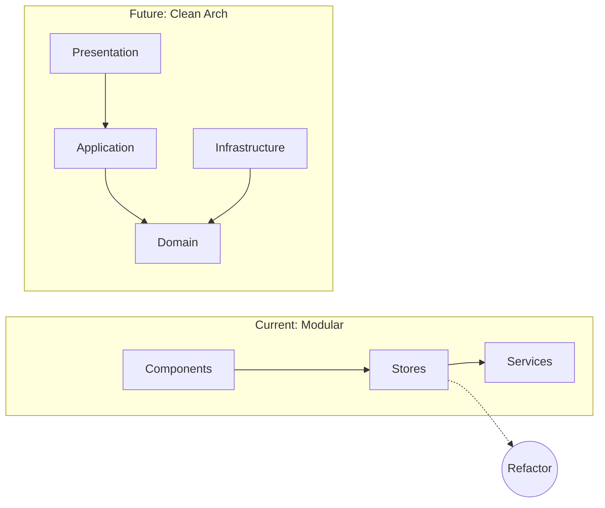
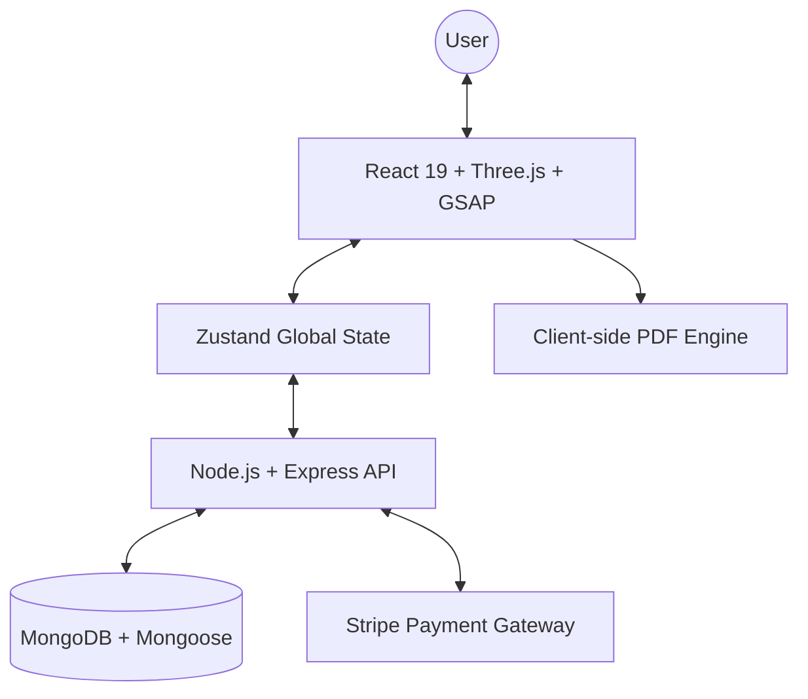

# ⚙️ Architecture Overview: ABC Cinema

ABC Cinema is built with a high-performance MERN architecture, currently implemented as a **Clean-Aligned Modular system** with a planned evolution towards strict **Clean Architecture and DDD**.

## 🏗️ Architectural Evolution Map

The system is designed to grow from its current modular state into a full enterprise-grade layered architecture.

## 🏗️ System Diagram (Conceptual)

## 💻 Frontend Stack

### **1. Rendering & 3D Optics**
- **React 19 + TypeScript:** Utilizing concurrent rendering and strong typing for a highly responsive and reliable UI.
- **React Three Fiber (R3F):** A React bridge for Three.js, used to create the isometric seat selection map.
- **Drei:** A helper library for R3F that provides pre-built components like `PerspectiveCamera` and `Html` overlays.

### **2. Premium Motion & UX**
- **GSAP (GreenSock):** Orchestrates complex timelines for page transitions and the "Film Reel" loader.
- **Framer Motion:** Handles micro-interactions and layout animations.
- **Lenis:** Provides smooth inertial scrolling across the landing page.

### **3. State Management**
- **Zustand:** A lightweight, hook-based store used to manage:
    - Current view (Home, Booking, Admin).
    - Selected movie and seat state.
    - Real-time booking status (Idle, Paying, Success).

## 🖥️ Backend & Security

### **1. API Design**
- **RESTful Architecture:** Clear separation of concerns between movie data, transactions, and user feedback.
- **Express Middleware:** Custom error boundaries and request validation.

### **2. Data Modeling**
- **MongoDB:** Flexible schema for movie metadata and nested seat arrangements.
- **Mongoose:** Strong typing and validation for transaction records.

### **3. Security**
- **AES Encryption:** (Planned/Conceptual) For sensitive employee/user data demographics as hinted in the 'About' section.
- **Stripe Elements:** Ensures payment data never touches our server, maintaining PCI compliance.

## 📄 Automated services
- **jsPDF:** Integrated client-side to generate ticket receipts immediately upon transaction confirmation.
